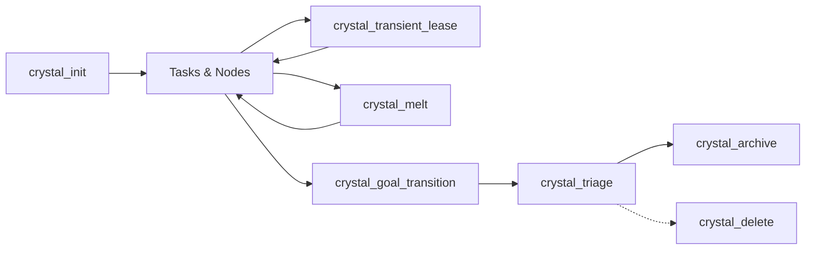

# Context Crystal MCP Server Instructions

Welcome to the Context Crystal Model Context Protocol (MCP) server. These guidelines define operational conventions, tool preferences, and lifecycle invariants for AI entities interacting with Context Crystal.

---

## 1. Installation & Binary Resolution

- **CLI Binary Location:** `~/.local/bin/ccrystal`
- **Cave Directory:** `.ccrystals/` at the repository or workspace root.
- **Server Mode:** Stdio JSON-RPC 2.0 via `ccrystal mcp`.

---

## 2. Tool Execution Hierarchy & Batching Preference

- **MCP Tools First:** Prioritize native MCP tools over running CLI commands via subshell terminals.
- **Atomic Batching (`crystal_batch`):** Compose compound semicolon-separated recipes (`node add ...; task done ...; conclude ...`) to minimize roundtrips and ensure atomic state persistence.

---

## 3. Standard Crystal Lifecycle Flow

0. **Discovery & Search (`crystal_search`):**
   Search and list cave crystals across multi-dimensional criteria (query text, temporal bounds, status, active leases, touching path, open tasks, lessons, author, aging state, and pagination). When called without filters, lists active crystals (most recently active first).
0b. **Cave Metrics & Statistics (`crystal_stats`):**
   Compute quantitative statistics on cave lifecycle, temporal genesis, structural totals, physical disk footprints (active vs. cold storage), and estimated prompt token savings. Reuses search filters to answer scoped operational queries (e.g. storage used for crystals updated in the last 7 days).
1. **Inception (`crystal_init`):**
   Initialize a dedicated crystal with `name`, `goal`, optional `intent`, `author`, and initial `tasks`.
2. **Work & Provenance Tracking:**
   - **Tasks:** `crystal_task_transition` (`action: "add"` or `"done"`).
   - **DAG Anchors & Nodes:** `crystal_checkpoint` for semantic anchors, or `node add` via `crystal_batch`.
   - **Fidelity Guarantee:** Default to `inferred` for agent-authored reasoning; use `intercepted` only for exact captured tool inputs/outputs.
3. **Transient Leases (`crystal_transient_lease`):**
   Register temporary working state (e.g. `git_worktree`). Always clean or promote leases before concluding work.
4. **Selective Context Hydration (`crystal_hydrate`):**
   Project tailored context beams into LLM context using `tail`, `from`, `to`, or `summary_only`.
5. **Sub-DAG Melting (`crystal_melt`):**
   For long-running tracks or large lattices, collapse chains of fine-grained intermediary steps into a single consolidated checkpoint node with aggregated artifact links to save prompt beam tokens deterministically.
6. **Conclusion (`crystal_goal_transition`):**
   Once all criteria are met, transition goal status to `concluded_success` (or `concluded_abandoned` if aborted/superseded) with a `summary`. Context Crystal automatically records a `resolution` DAG node preserving completion provenance.
7. **Hygiene & Triage (`crystal_triage`):**
   Inspect cave health. Classify crystals into `Active`, `Solid`, and `Stale`. Crystals with status `concluded_success` or `concluded_abandoned` and 0 active leases are classified as `Solid` and `CandidateForCleanup`.
8. **Cold Storage Archiving (`crystal_archive`):**
   **Preferred non-destructive cleanup:** Move concluded crystals into cold storage (`.ccrystals/archive/`). All state and artifacts are preserved, and crystals can be restored anytime with `crystal_unarchive`.
9. **Destructive Cleanup (`crystal_delete`):**
   Permanently delete crystals only when explicitly instructed by the operator for scratch spikes or unneeded throwaway work. Never perform unprompted deletions.

---

## 4. Key Invariants

- **PII & Data Safety:** Follow synthetic example hygiene (RFC 2606 domains `example.com`, neutral personas).
- **Transient Cleanliness:** Leave no dangling leases behind.
- **Dual-Key / Remote Gating:** Never autonomously push to remote repositories (`git push`). Always confirm with the operator.
