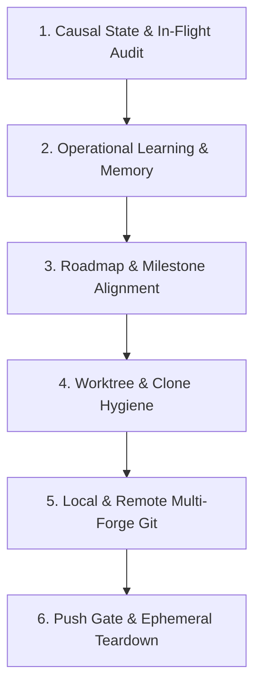

# Context Crystal Developer & Session Hygiene Skill

This skill codifies the complete **Session Conclusion, Debrief & Hygiene Protocol** for human developers and AI entities working on the **Context Crystal** codebase.

While onboarding workflows focus on session inception, this skill standardizes the equally vital ceremony of **session closure**—guaranteeing that every session leaves the repository, remote forges, causal crystals, and transient workspace resources in a clean, predictable, and zero-debris state.

Activate this skill whenever a collaborator indicates: *"let's wrap up for today"*, *"let's close the session"*, *"clean up before we leave"*, or before tearing down an active environment.

---

## The Six Pillars of Session Conclosure



---

## Pillar 1: Causal State & In-Flight Audit

Never close a session with unresolved or ambiguous crystal state:

1. **Run Cave Triage:**
   Execute `ccrystal triage` or call MCP `crystal_triage` to evaluate active crystals across the cave.
2. **Cold Storage for Concluded Crystals:**
   Move all concluded, completed, or superseded crystals to cold storage (`ccrystal archive <id>` or MCP `crystal_archive`) to prevent active cave bloat while preserving full DAG history and artifact lineage.
3. **Clean Archival & In-Flight Dependency Audit:**
   Before archiving a crystal, explicitly audit whether the session spawned **external asynchronous commitments** (e.g. upstream PRs awaiting review, third-party directory listings awaiting crawl, verification tokens) or **unregistered workspace resources** (temporary worktrees or clones):
   - **Commitments In-Flight:** Do **NOT** archive prematurely. Keep the crystal in `in_progress` status.
   - **Track Tasks:** Ensure open tracking tasks (`task-N`) exist for all pending external events.
   - **Defend Leases:** Register or maintain transient resource leases (`git_worktree`, `mock_service`) to defend in-progress clones against premature deletion.
   - **Record Checkpoint:** Append a checkpoint node (`node-N`) logging the latest status check.

---

## Pillar 2: Operational Learning & Memory Codification

Durable insights and architectural lessons must not remain trapped in conversational transcripts:

1. **Operational Learning Gate:**
   Reflect on any friction, surprises, or new patterns discovered during the session (e.g. linker flags, API peculiarities, forge behavior).
2. **Persistent Cognitive Memory (Vendor-Agnostic / If Configured):**
   If the collaborator or agent harness has a long-term memory or cognitive persistence mechanism configured (e.g. Engram, persistent memory scratchpad, or custom agent memory), save major architectural decisions, trade-offs, and learnings to ensure recall across future sessions.
3. **Repository Invariants:**
   If a learning is universal, reproducible, and relevant to the codebase, codify it directly into [AGENTS.md](AGENTS.md) or relevant skill documents. Repo-internal meta-rules belong in internal docs; user-facing changes belong in public release notes.

---

## Pillar 3: Roadmap & Milestone Alignment

Ensure the next session can resume instantly without amnesia or priority ambiguity:

1. **Review Next Steps:**
   Inspect [conductor/next-steps.md](conductor/next-steps.md) and [conductor/tracks.md](conductor/tracks.md).
2. **Reflect on Architectural Ordering:**
   Evaluate whether recent discoveries impact future tracks (e.g. scheduling Cold Storage Purge before Cross-Crystal Connections to avoid rework).
3. **Update Next Track Registration:**
   Explicitly name and detail the immediate next track so that the next session can branch into a worktree and start with zero setup friction.

---

## Pillar 4: Worktree & Clone Lifecycle Hygiene

Prevent orphaned git worktrees and auxiliary clones from consuming disk space and creating confusion:

1. **Audit Active Worktrees:**
   Run `git worktree list` from the primary repository. Ensure only persistent trees (`main`, `gh-pages`) remain.
2. **Audit Auxiliary Worktree Directory:**
   Inspect `../ccrystal-worktrees/`:
   - If an upstream PR has been merged or closed, safely remove the clone directory (`rm -rf ../ccrystal-worktrees/<name>`).
   - If a clone is tied to an active lease, preserve it and confirm its path matches the lease.
3. **Never Remove Prematurely:**
   Never prune a track worktree until its PR is merged on the remote forge and local `main` is fast-forwarded.

---

## Pillar 5: Local & Remote Multi-Forge Git Hygiene

Context Crystal synchronizes across two upstream forges: **GitHub** (`github`) and **Codeberg** (`origin`). Both enforce protected `main` branches and require linear, PR-reviewed history:

1. **Working Tree Verification:**
   Verify `git status` across all workspaces (`context-crystal`, `context-crystal-gh-pages`). Ensure all changes are committed and cryptographically signed (`user.signingkey`).
2. **Clean Local Merged Branches:**
   Safely delete local branches that have merged into `main`:

   ```bash
   git branch --merged main | grep -v -E "^\*|main|gh-pages" | xargs -r git branch -d
   ```

3. **Prune Stale Remote Pointers:**
   Run `git fetch --prune github && git fetch --prune origin` so local tracking pointers drop branches already merged and deleted on the remotes.
4. **Clean Merged Remote Branches on Codeberg & GitHub:**
   Safely remove merged feature branches from remotes using tolerant per-branch deletion:

   ```bash
   for b in branch1 branch2; do
     git push origin --delete "$b" 2>/dev/null || true
   done
   ```

5. **Final Remote Audit:**
   Verify `git branch -a` shows only `main` and `gh-pages` across local and remote heads.

---

## Pillar 6: Operator Push Gate & Ephemeral File Teardown

To honor our **Dual-Credential Strategy & Push Gate (Cryptographic Role Separation)**:

1. **Push Helper Pattern:**
   When multiple pushes across remotes or worktrees are pending, generate a clean, executable script (`/tmp/push_pending.sh`) with `set -euo pipefail`.
2. **Strict Operator Confirmation:**
   Entities must **never** execute `git push` autonomously. Instruct the operator to run the script using their locked transport key (SSH remote authentication).
3. **Ephemeral File Teardown:**
   Immediately after the push succeeds, remove all temporary scripts (`rm -f /tmp/push_*.sh`). Do not leave scratch scripts in `/tmp` or the workspace.

---

## Quick-Reference Checklist

Before concluding any session, check off each item:

- [ ] `ccrystal triage` executed; concluded crystals archived to cold storage.
- [ ] In-flight external dependencies audited; active crystals defend transient leases.
- [ ] Durable learnings recorded to long-term memory (if configured) and codified into docs if universal.
- [ ] Roadmap ([conductor/next-steps.md](conductor/next-steps.md)) updated with next track priorities.
- [ ] Merged clones/worktrees in `../ccrystal-worktrees/` pruned.
- [ ] Local merged branches deleted with `git branch -d`.
- [ ] Remote branches pruned (`fetch --prune`) and dead branches deleted.
- [ ] All workspaces committed with signed commits (`user.signingkey`).
- [ ] Operator executed push helper with locked transport key.
- [ ] Ephemeral helper scripts in `/tmp` destroyed.
- [ ] Both `github` and `origin` remotes verified up to date and clean.
